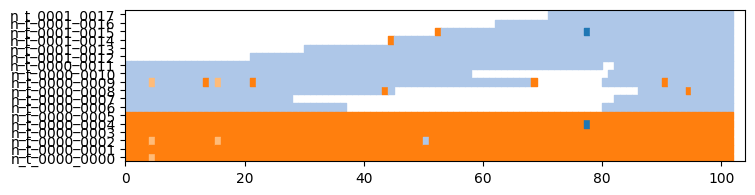
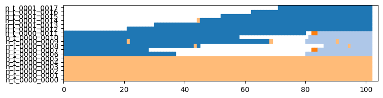
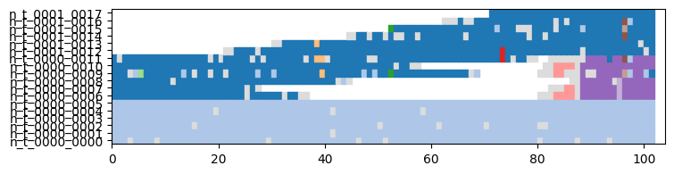
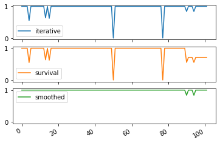
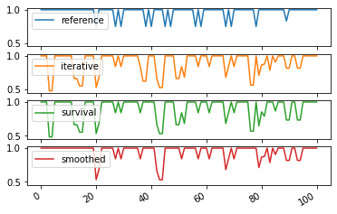

Dynamic Communities detection and evaluation
============================================

If tnerwork library is not installed, you need to install it, for
instance using the following command

.. code:: ipython3

    #%%capture #avoid printing output
    #!pip install --upgrade git+https://github.com/Yquetzal/tnetwork.git

.. code:: ipython3

    %load_ext autoreload
    %autoreload 2
    import tnetwork as tn
    import seaborn as sns
    import pandas as pd
    import networkx as nx
    import numpy as np

Creating an example dynamic graph with changing community structure
-------------------------------------------------------------------

We create a simple example of dynamic community evolution using the
generator provided in the library. We generate a simple ship of Theseus
scenario. Report to the corresponding tutorial to fully understand the
generation part if needed.

.. code:: ipython3

    my_scenario = tn.ComScenario(alpha=0.8,random_noise=0.1)
    [com1,com2] = my_scenario.INITIALIZE([6,6],["c1","c2"])
    (com2,com3)=my_scenario.THESEUS(com2,delay=20)
    my_scenario.CONTINUE(com3,delay=10)
    
    #visualization
    (generated_network_IG,generated_comunities_IG) = my_scenario.run()
    
    plot = tn.plot_longitudinal(generated_network_IG,generated_comunities_IG,height=200)
    generated_network_SN = generated_network_IG.to_DynGraphSN(slices=1)
    generated_communities_SN = generated_comunities_IG.to_DynCommunitiesSN(slices=1)

.. parsed-literal::

    100% (8 of 8) |##########################| Elapsed Time: 0:00:00 ETA:  00:00:00/usr/local/lib/python3.7/site-packages/numpy/core/numeric.py:2327: FutureWarning: elementwise comparison failed; returning scalar instead, but in the future will perform elementwise comparison
      return bool(asarray(a1 == a2).all())

.. image:: output_5_1.png

Let’s look at the graph at different stages. There are no communities.

.. code:: ipython3

    last_time = generated_network_IG.end()
    print(last_time)
    times_to_plot = [0,int(last_time/3),int(last_time/3*2),last_time-1]
    plot = tn.plot_as_graph(generated_network_IG,ts=times_to_plot,width=200,height=200)

.. parsed-literal::

    102

.. image:: output_7_1.png

Algorithms for community detection are located in the tnetwork.DCD
package

.. code:: ipython3

    import tnetwork.DCD as DCD

First algorithm: Iterative match
--------------------------------

Iterative match consists in applying a static algorithm at each step and
matching communities in successive snapshots if they are similar. Check
the doc for more details.

Without particular parameters, it uses the louvain method and the
jaccard coefficient.

.. code:: ipython3

    com_iterative = DCD.iterative_match(generated_network_SN)

The static algorithm, the similarity function and the threashold to
consider similar can be changed

.. code:: ipython3

    custom_match_function = lambda x,y: len(x&y)/max(len(x),len(y))
    com_custom = DCD.iterative_match(generated_network_SN,match_function=custom_match_function,CDalgo=nx.community.greedy_modularity_communities,threshold=0.5)

Visualizing communities
-----------------------

One way to visualize the evolution of communities is to plot the graph
at some snapshots. By calling the ``plot_as_graph`` function with
several timestamps, we plot graphs at those timestamps while ensuring:

-  That the position of nodes stay the same between snapshots
-  That the same color in different plots means that nodes belong to the
   same dynamic communities

.. code:: ipython3

    last_time = generated_network_IG.end()
    times_to_plot = [0,int(last_time/3),int(last_time/3*2),last_time-1]
    plot = tn.plot_as_graph(generated_network_IG,com_iterative,ts=times_to_plot,auto_show=True,width=200,height=200)

.. image:: output_16_0.png

Another solution is to plot a longitudinal visualization: each
horizontal line corresponds to a node, time is on the x axis, and colors
correspond to communities. Grey means that a node corresponds to no
community, white that the node is not present in the graph (or has no
edges)

.. code:: ipython3

    to_plot = tn.plot_longitudinal(generated_network_SN,com_iterative,height=200)

.. image:: output_18_0.png

Survival Graph
~~~~~~~~~~~~~~

This method matches communities not only between successive snaphsots,
but between any snapshot, constituting a survival graph on which a
community detection algorithm detects communities of communities =>
Dynamic communities

.. code:: ipython3

    com_survival = DCD.label_smoothing(generated_network_SN)
    plot = tn.plot_longitudinal(generated_network_SN,com_survival,height=200)

.. parsed-literal::

    starting label_smoothing method 

Smoothed louvain
~~~~~~~~~~~~~~~~

The smoothed Louvain algorihm is very similar to the simple iterative
match, at the difference that, at each step, it initializes the
partition of the Louvain algorithm with the previous partition instead
of having each node in its own community as in usual Louvain.

It has the same options as iterative match, since only the community
detection process at each step changes, not the matching

.. code:: ipython3

    com_smoothed = DCD.smoothed_louvain(generated_network_SN)
    plot = tn.plot_longitudinal(generated_network_SN,com_smoothed,height=200)

.. parsed-literal::

     98% (100 of 102) |##################### | Elapsed Time: 0:00:00 ETA:   0:00:00

Smoothed graph
~~~~~~~~~~~~~~

The smoothed-graph algorithm is similar to the previous ones, but the
graph at each step is *smoothed* by the community structure found in the
previous step. (An edge with a small weight is added between any pair of
nodes that where in the same community previously. This weight is
determined by a parameter ``alpha``)

.. code:: ipython3

    com_smoothed_graph = DCD.smoothed_graph(generated_network_SN)
    plot = tn.plot_longitudinal(generated_network_SN,com_smoothed_graph,height=200)

.. parsed-literal::

     97% (99 of 102) |###################### | Elapsed Time: 0:00:00 ETA:   0:00:00

.. image:: output_24_1.png

Matching with a custom function
~~~~~~~~~~~~~~~~~~~~~~~~~~~~~~~

The iterative match and survival graph methods can also be instantiated
with any custom community detection algorithm at each step, and any
matching function, as we can see below. The match function takes as
input the list of nodes of both communities, while the community
algorithm must follow the signature of networkx community detection
algorithms

.. code:: ipython3

    custom_match_function = lambda x,y: len(x&y)/max(len(x),len(y))
    com_custom2 = DCD.iterative_match(generated_network_SN,match_function=custom_match_function,CDalgo=nx.community.greedy_modularity_communities)
    plot = tn.plot_longitudinal(generated_network_SN,com_custom2,height=200)

.. image:: output_26_0.png

Another algoritm in python: CPM
~~~~~~~~~~~~~~~~~~~~~~~~~~~~~~~

CPM stands for Clique Percolation Method. An originality of this
approach is that it yiealds overlapping communities.

Be careful, the visualization is not currently adapted to overlapping
clusters…

.. code:: ipython3

    com_CPM = DCD.rollingCPM(generated_network_SN,k=3)
    plot = tn.plot_longitudinal(generated_network_SN,com_CPM,height=200)

.. parsed-literal::

    CD detection done 102

Dynamic partition evaluation
----------------------------

The goal of this section is to present the different types of dynamic
community evalutation implemented in tnetwork.

For all evaluations below, no conclusion should be drawn about the
quality of algorithms… .

.. code:: ipython3

    #Visualization
    plot = tn.plot_longitudinal(communities=generated_comunities_IG,height=200,sn_duration=1)

.. image:: output_30_0.png

Quality at each step
~~~~~~~~~~~~~~~~~~~~

The first type of evaluation we can do is simply to compute, at each
type, a quality measure. By default, the method uses Modularity, but one
can provide to the function its favorite quality function instead. It is
the simplest adaptation of *internal evaluation*.

Note that \* The result of an iterative approach is identical to the
result of simply applying a static algorithm at each step \* Smoothing
therefore tends to lesser the scores. \* The result migth or might not
be computable at each step depending on the quality function used (e.g.,
modularity requires a complete partition of the networks to be computed)

.. code:: ipython3

    quality_ref,sizes_ref = DCD.quality_at_each_step(generated_communities_SN,generated_network_SN)
    quality_iter,sizes_iter = DCD.quality_at_each_step(com_iterative,generated_network_SN)
    quality_survival,sizes_survival = DCD.quality_at_each_step(com_survival,generated_network_SN)
    quality_smoothed,sizes_smoothed = DCD.quality_at_each_step(com_smoothed,generated_network_SN)
    
    df = pd.DataFrame({"reference":quality_ref,"iterative":quality_iter,"survival":quality_survival,"smoothed":quality_smoothed})
    df.plot(subplots=True,sharey=True)

.. parsed-literal::

    array([<matplotlib.axes._subplots.AxesSubplot object at 0x11f1bd8d0>,
           <matplotlib.axes._subplots.AxesSubplot object at 0x11f5aa6d0>,
           <matplotlib.axes._subplots.AxesSubplot object at 0x11e993e10>,
           <matplotlib.axes._subplots.AxesSubplot object at 0x108343d10>],
          dtype=object)

.. image:: output_32_1.png

Average values
~~~~~~~~~~~~~~

One can of course compute average values over all steps. Be careful
however when interpreting such values, as there are many potential
biases: \* Some scores (such as modularity) are not comparable between
graphs of different sizes/density, so averaging values obtained on
different timesteps might be incorrect \* The *clarity* of the community
structure might not be homogeneous, and your score might end up
depending mostly on results on a specific period \* Since the number of
nodes change in every step, we have the choice of weighting the values
by the size of the network \* etc.

Since the process is the same for all later functions, we won’t repeat
it for the others in this tutorial

.. code:: ipython3

    print("iterative=", np.average(quality_iter),"weighted:", np.average(quality_iter,weights=sizes_iter))
    print("survival=", np.average(quality_survival),"weighted:", np.average(quality_survival,weights=sizes_survival))
    print("smoothed=", np.average(quality_smoothed),"weighted:", np.average(quality_smoothed,weights=sizes_smoothed))

.. parsed-literal::

    iterative= 0.4289862014179952 weighted: 0.4357461539951767
    survival= 0.39927872978552464 weighted: 0.39689292217118277
    smoothed= 0.42992554634769103 weighted: 0.4365993079467363

Similarity at each step
~~~~~~~~~~~~~~~~~~~~~~~

A second type of evaluation consists in adaptating *external
evaluation*, i.e., comparison with a known reference truth.

It simply computes at each step the similarity between the computed
communities and the ground truth. By default, the function uses the
Adjusted Mutual Information (AMI or aNMI), but again, any similarity
measure can be provided to the function.

Note that, as for quality at each step, smoothing is not an advantage,
community identities accross steps has no impact.

There is a subtility here: since, often, the dynamic ground truth might
have some nodes without affiliations, we make the choice of comparing
only what is known in the ground truth, i.e., if only 5 nodes out of 10
have a community in the ground truth at time t, the score of the
proposed solution will depends only on those 5 nodes, and the
affiliations of the 5 others is ignored

.. code:: ipython3

    quality_iter,sizes = DCD.similarity_at_each_step(generated_communities_SN,com_iterative)
    quality_survival,sizes = DCD.similarity_at_each_step(generated_communities_SN,com_survival)
    quality_smoothed,sizes = DCD.similarity_at_each_step(generated_communities_SN,com_smoothed)
    
    df = pd.DataFrame({"iterative":quality_iter,"survival":quality_survival,"smoothed":quality_smoothed})
    df.plot(subplots=True,sharey=True)
    
    

.. parsed-literal::

    array([<matplotlib.axes._subplots.AxesSubplot object at 0x11fb59290>,
           <matplotlib.axes._subplots.AxesSubplot object at 0x11f90ccd0>,
           <matplotlib.axes._subplots.AxesSubplot object at 0x11eb31c50>],
          dtype=object)

Smoothness Evaluation
---------------------

We can evaluate the smoothness of a partition by comparing how the
partition in each step is similar to the partition in the next. Again,
any measure can be used, by default the overlapping NMI, because two
adjacent partitions do not necessarily have the same nodes. \* This
evaluation is *internal*. \* This time, it depends on the *labels* given
to nodes accross steps, so a static algorithm applied at each step would
have a score of zero. \* The score does not depends at all on the
quality of the solution, i.e., having all nodes in the same partition at
every step would obtain a perfect score of 1

.. code:: ipython3

    quality_ref,sizes_ref = DCD.consecutive_sn_similarity(generated_communities_SN)
    quality_iter,sizes_iter = DCD.consecutive_sn_similarity(com_iterative)
    quality_survival,sizes_survival = DCD.consecutive_sn_similarity(com_survival)
    quality_smoothed,sizes_smoothed = DCD.consecutive_sn_similarity(com_smoothed)
    
    df = pd.DataFrame({"reference":quality_ref,"iterative":quality_iter,"survival":quality_survival,"smoothed":quality_smoothed})
    df.plot(subplots=True,sharey=True)
    
    

.. parsed-literal::

    array([<matplotlib.axes._subplots.AxesSubplot object at 0x11f103850>,
           <matplotlib.axes._subplots.AxesSubplot object at 0x11c7af710>,
           <matplotlib.axes._subplots.AxesSubplot object at 0x11fc5c7d0>,
           <matplotlib.axes._subplots.AxesSubplot object at 0x11f46e610>],
          dtype=object)

Global scores
-------------

Another family of scores we can compute are not based on step by step
computations, but rather compute directly a single score on whole
communities

Longitudinal Similarity
~~~~~~~~~~~~~~~~~~~~~~~

This score is computed using a usual similarity measure, by default the
AMI. But instead of computing the score for each step independently, it
is computed once, consider each (node,time) pair as a data point
(instead of each node in a static network). \* The evaluation is
*external*, it requires a (longitudinal) reference partition \* It takes
into account both the similarity at each step and the labels accros
steps \* Similar to step by step similarity, only (node,time) couples
with a known affiliation in the reference partition are used, others are
ignored

.. code:: ipython3

    quality_iter = DCD.longitudinal_similarity(generated_communities_SN,com_iterative)
    quality_survival = DCD.longitudinal_similarity(generated_communities_SN,com_survival)
    quality_smoothed = DCD.longitudinal_similarity(generated_communities_SN,com_smoothed)
    
    print("iterative: ",quality_iter)
    print("survival: ",quality_survival)
    print("smoothed: ",quality_smoothed)

.. parsed-literal::

    iterative:  0.9451292907933111
    survival:  0.8234124633781458
    smoothed:  0.9868504021347683

Global Smoothness
~~~~~~~~~~~~~~~~~

Trhee methods are proposed to evaluate the smoothness at the global
level.

The first is the average value of partition smoothness as presented
earlier, and is called ``SM-P`` for Partition Smoothness

The second one computes how many changes in affiliation there are, and
the score ``SM-N`` (Node Smoothness) is 1/number of changes \* It
penalizes methods with many *glitches*, i.e., transient affiliation
change. \* It does not penalize long term changes

The third computes instead the entropy per node, and the score ``SM-L``
(Label smoothness) is 1/average node entropy. \* It does not penalize
much glitches \* It advantages solutions in which nodes tend to belong
to few communities

For all 3 scores, higher is better.

.. code:: ipython3

    print("iterative: SM-P" ,DCD.SM_P(com_iterative), "SM-N:",DCD.SM_N(com_iterative), " SM-L:",DCD.SM_L(com_iterative))
    print("survival: SM-P ",DCD.SM_P(com_survival), "SM-N:",DCD.SM_N(com_survival), " SM-L:",DCD.SM_L(com_survival))
    print("smoothed: SM-P:",DCD.SM_P(com_smoothed), "SM-N:",DCD.SM_N(com_smoothed), " SM-L:",DCD.SM_L(com_smoothed))

.. parsed-literal::

    iterative: SM-P 0.9001839896381273 SM-N: 0.023255813953488372  SM-L: 3.6914110221883676
    survival: SM-P  0.9026384453495243 SM-N: 0.03333333333333333  SM-L: 18.48733611718878
    smoothed: SM-P: 0.9470754696907387 SM-N: 0.05555555555555555  SM-L: 4.416478672484498

