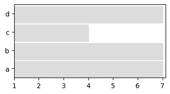

Quick Start
===========

This is an introduction to the key functionalities of the tnetwork
library. Check documentation for more details

.. code-block:: ipython3

    %load_ext autoreload
    %autoreload 2
    
    import tnetwork as tn
    import networkx as nx
    import seaborn as sns

Creating a dynamic graph
~~~~~~~~~~~~~~~~~~~~~~~~

We create a dynamic graph object. Two types exist, using snapshot or
interval respresentations. In this example, we use intervals

.. code:: ipython3

    my_d_graph = tn.DynGraphIG()

We add some nodes and edges. Intervals are inclusive on the left and non
inclusive on the right: [start,end[

.. code:: ipython3

    my_d_graph.add_node_presence("a",(1,5)) #add node a from time 1 to 5
    my_d_graph.add_nodes_presence_from(["a","b","c"],(2,3)) # add ndoes a,b,c from 2 to 3
    my_d_graph.add_nodes_presence_from("d",(2,6)) #add node from 2 to 6
    
    my_d_graph.add_interaction("a","b",(2,3)) # link nodes a and b from 2 to 3 
    my_d_graph.add_interactions_from(("b","d"),(2,5)) # link nodes b and d from 2 to 5

Visualizing your graph
~~~~~~~~~~~~~~~~~~~~~~

We can visualize only nodes using a longitudinal representation

.. code:: ipython3

    plot = tn.plot_longitudinal(my_d_graph,width=400,height=200)

.. image:: output_7_0.png

Or visualize the whole graph at any given time

.. code:: ipython3

    plot = tn.plot_as_graph(my_d_graph,ts=[2,3,4],width=300,height=300)

.. image:: output_9_0.png

Accessing graph information
~~~~~~~~~~~~~~~~~~~~~~~~~~~

We can query the graph at a given time and get a networkx object

.. code:: ipython3

    my_d_graph.graph_at_time(2).nodes()

.. parsed-literal::

    NodeView(('a', 'b', 'c', 'd'))

We can also query the presence periods of some nodes, for instance.
Check documentation for more possibilities.

.. code:: ipython3

    my_d_graph.node_presence(["a","b"])

.. parsed-literal::

    {'a': [1,5[ , 'b': [2,5[ }

Conversion between snapshots<->interval representations
~~~~~~~~~~~~~~~~~~~~~~~~~~~~~~~~~~~~~~~~~~~~~~~~~~~~~~~

It is possible to transform an interval representation into a snapshot
one, and reciprocally. We need to specify an agggregation step, i.e.,
each snapshot of the resulting dynamic graph corresponds to a period of
the chosen length.

.. code:: ipython3

    my_d_graph_SN = my_d_graph.to_DynGraphSN(slices=1)

We plot the graph to check that it has not changed (each snapshot has a
duration of 1, a continuous horizontal line corresponds to a node
present in several adjacent snapshots)

.. code:: ipython3

    to_plot = tn.plot_longitudinal(my_d_graph,width=400,height=200)

.. parsed-literal::

    /usr/local/lib/python3.7/site-packages/numpy/core/numeric.py:2327: FutureWarning: elementwise comparison failed; returning scalar instead, but in the future will perform elementwise comparison
      return bool(asarray(a1 == a2).all())

.. image:: output_17_1.png

Slicing, aggregating
~~~~~~~~~~~~~~~~~~~~

We can slice a dynamic network to keep only a chosen period, and
re-aggregate it. Note that aggregation can be done according to dates
(week, months…) if time values are provided as timestamps (see
documentation for details)

.. code:: ipython3

    sliced = my_d_graph.slice(2,5)
    to_plot = tn.plot_longitudinal(sliced,width=400,height=200)

.. image:: output_19_0.png

.. code:: ipython3

    aggregated = my_d_graph_SN.aggregate_sliding_window(bin_size=3)
    to_plot = tn.plot_longitudinal(aggregated,width=400,height=200)

Generate and detect dynamic community structures
------------------------------------------------

One of the key features of tnetwork is to be able to generate networks
with community structures, and to detect dynamic communities in
networks.

Let’s start by generating a random toy model and plotting it with its
communities represented as colors

.. code:: ipython3

    toy_graph,toy_ground_truth = tn.DCD.generate_toy_random_network(alpha=0.9,random_noise=0.05)
    plot = tn.plot_longitudinal(toy_graph,toy_ground_truth,height=300)

.. parsed-literal::

    100% (26 of 26) |########################| Elapsed Time: 0:00:00 ETA:  00:00:00/usr/local/lib/python3.7/site-packages/numpy/core/numeric.py:2327: FutureWarning: elementwise comparison failed; returning scalar instead, but in the future will perform elementwise comparison
      return bool(asarray(a1 == a2).all())

.. image:: output_22_1.png

.. code:: ipython3

    plot = tn.plot_as_graph(toy_graph,toy_ground_truth,ts=[1,100,150],width=300,height=300)

.. image:: output_23_0.png

We can then run a dynamic community detection algorithm on the graph.
Several methods are available, check the documentation for more details

.. code:: ipython3

    dynamic_communities = tn.iterative_match(toy_graph)

Let’s check what the communities found look like

.. code:: ipython3

    plot = tn.plot_longitudinal(communities=dynamic_communities,height=300)

.. image:: output_27_0.png

Finally, we can evaluate the quality of this solution using some quality
functions designed for dynamic communities, for instance:

.. code:: ipython3

    print("longitudinal similarity to ground truth: ",tn.longitudinal_similarity(toy_ground_truth,dynamic_communities))
    print("Partition smoothness SM-P: ",tn.SM_P(dynamic_communities))

.. parsed-literal::

    longitudinal similarity to ground truth:  0.9359604721992668
    Partition smoothness SM-P:  0.9415586723076299

